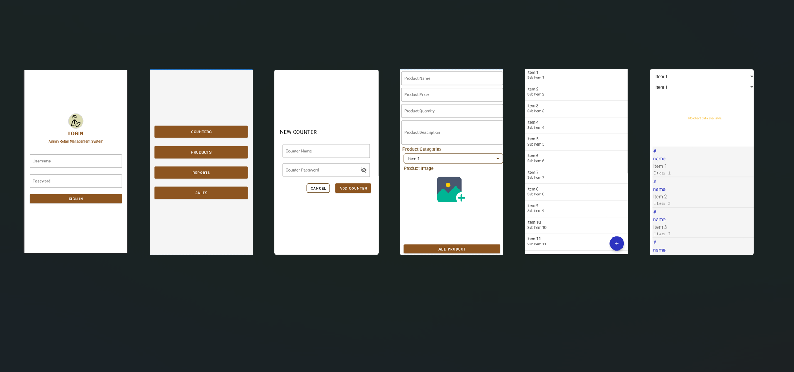
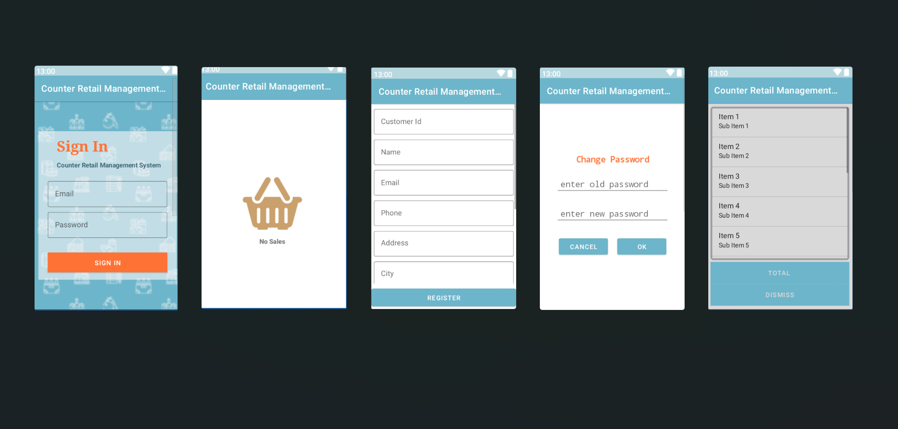
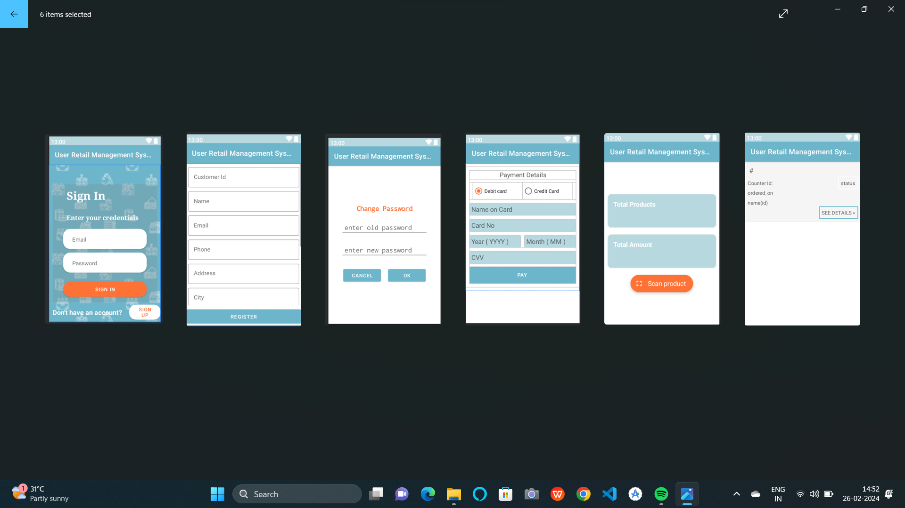

# Android-Retail-Store-Inventory-System
A mobile-based app built using Android Studio to streamline retail store operations. The system includes three modules: **Admin**, **Counter**, and **User**, each with specific features for efficient management.
---
## 🚀 Key Features
- Role-based login for Admin, Counter, and User
- Inventory and counter management
- Product billing and checkout (card/cash)
- Sales reports with graphical views
- User profile and purchase history
---
## 🔧 Technologies
- **Frontend:** Android Studio (XML)
- **Backend:** Java
- **Database:** MS SQL Server
---
## 🧩 Modules

### 🛠️ Admin
- Manage counters, products, and inventory
- View graphical sales reports
- Dashboard overview

### 💼 Counter
- Scan/add products, checkout system
- Track daily sales

### 👤 User
- Register, login, and edit profile
- Scan products, checkout, view history
---
## 🖼️ Screenshots

### 🔐 Admin Module


### 💼 Counter Module


### 👤 User Module

---

## 📥 How to Run
```bash
git clone https://github.com/janhvi9101/Android-Retail-Store-Inventory-System.git

1.Open in Android Studio
2.Set up the MS SQL Server backend
3.Build and run on an emulator or device
